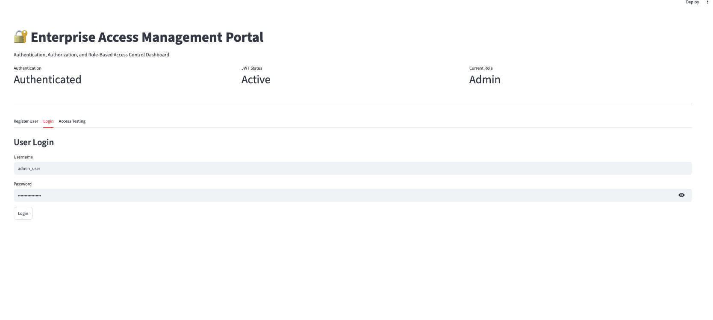
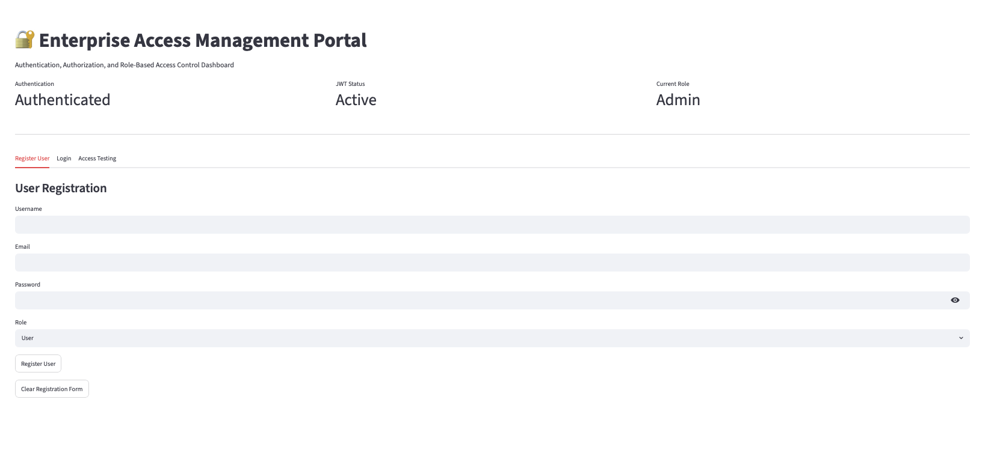
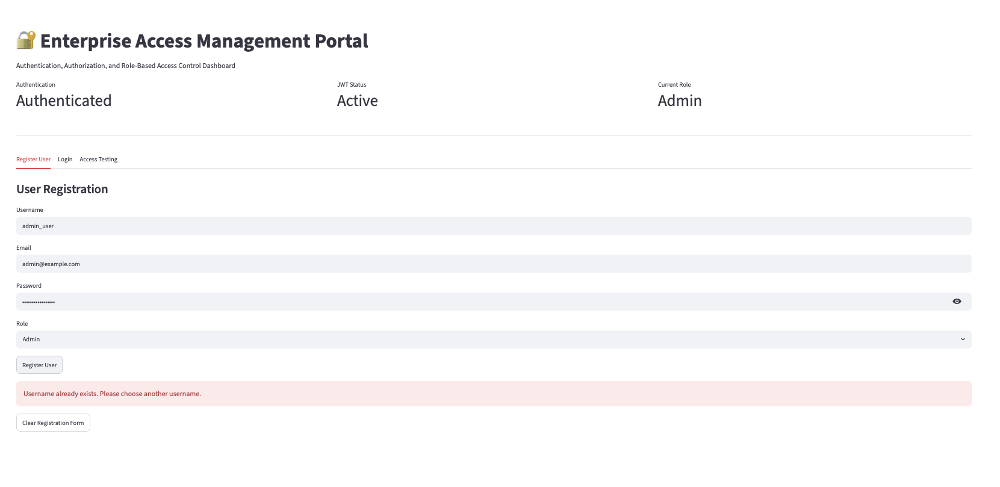
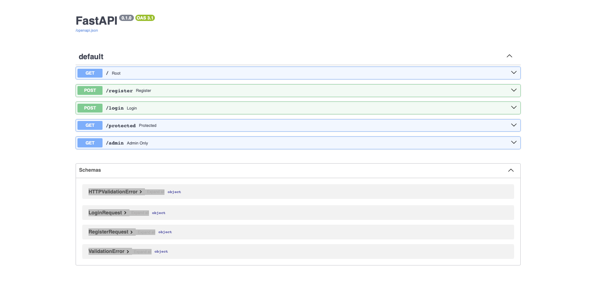
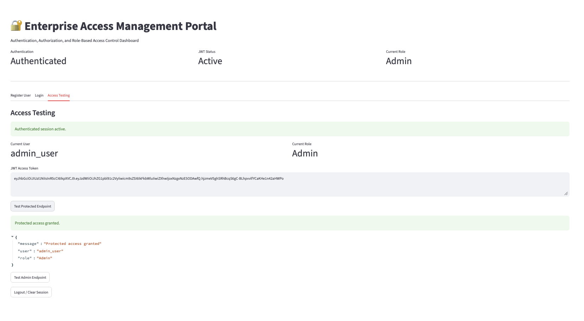
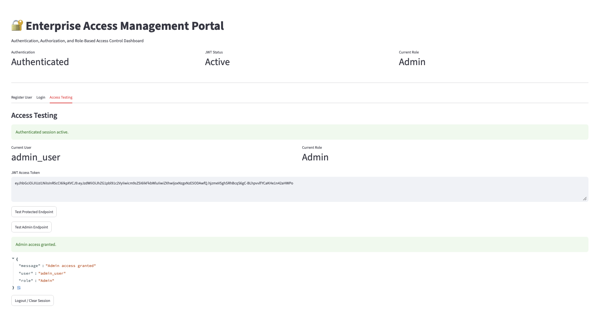
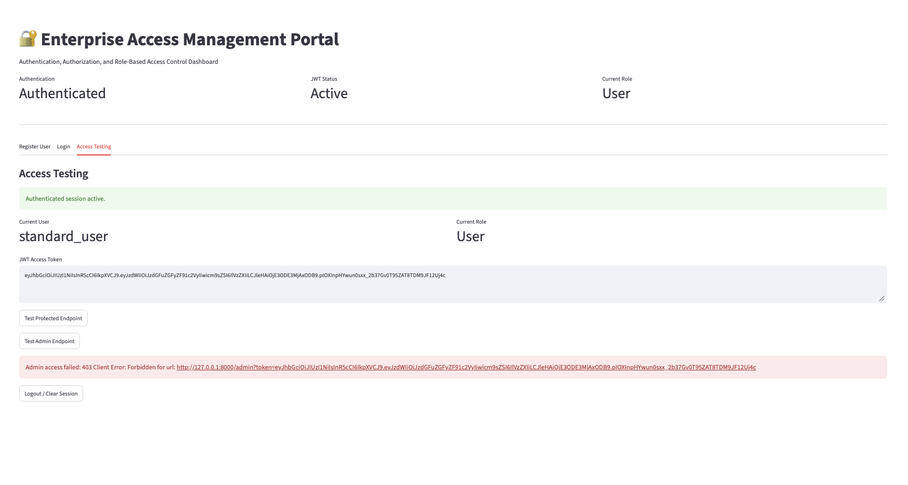
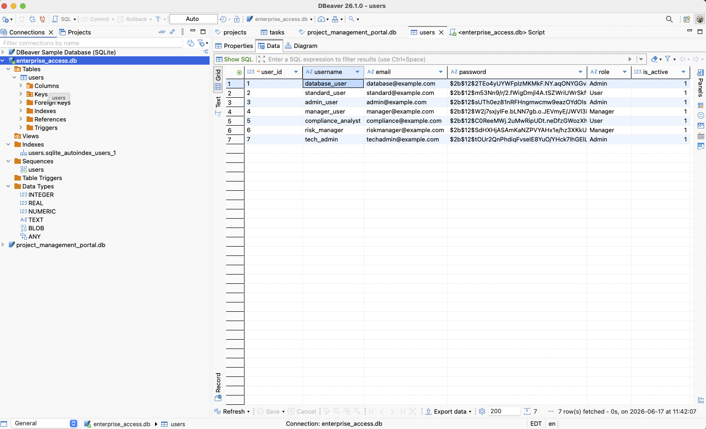
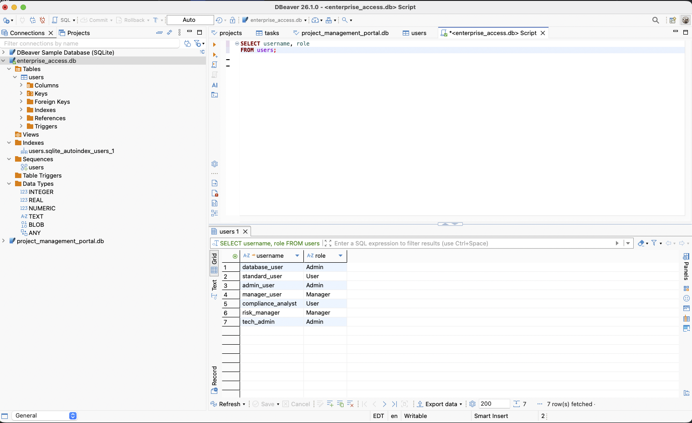

# Enterprise Access Management Portal

## Overview

Enterprise Access Management Portal is a full-stack software engineering application that simulates how enterprise systems manage users, roles, authentication, authorization, and secure access.

The application demonstrates user registration, secure password hashing, JWT-based authentication, role-based access control, protected API endpoints, admin-only authorization, SQLite database persistence, and a Streamlit dashboard for interacting with the system.

This project showcases real-world software engineering concepts including security architecture, REST API development, database integration, user management workflows, frontend-backend communication, error handling, GitHub workflows, and end-to-end application testing.

## Features Implemented

- User registration
- User login
- Password hashing with bcrypt
- JWT-based authentication
- Role-based access control
- Protected API endpoints
- Admin-only API endpoint
- SQLite user persistence
- Duplicate username validation
- User-friendly registration errors
- Streamlit access management dashboard
- DBeaver database validation
- Swagger/OpenAPI documentation

## Solution Architecture

```text
User
↓
Streamlit Dashboard
↓
FastAPI REST API
↓
Authentication Service
↓
JWT Token Service
↓
User Service Layer
↓
SQLite Database
```

## Application Screenshots

### Main Dashboard



### User Registration



### Duplicate Username Validation



### Swagger API Documentation



### Protected Access



### Admin Access



### User Access Denied



### SQLite Database



### SQL Query Validation 



## Database Design 

The application uses SQLite for persistent user storage.

### Users Table

| Column    | Description
|-----------| --- |
| user_id   | Primary key with auto-increment |
| username  | Unique username |
| email     | User email address |
| password  | bcrypt hashed password|
| role      | User, Manager, or Admin |
| is_active | Active user status flag|

### Security Features

* Passwords are hashed using bcrypt
* JWT tokens are generated after successful login
* Protected endpoints require token validation
* Admin-only endpoints require Admin role authorization
* Duplicate usernames are rejected
* Plain-text passwords are not stored in the database

## Technology Stack

### Backend

* Python
* FastAPI
* SQLite
* python-jose
* passlib
* bcrypt
* Pydantic

### Frontend

* Streamlit

### Development Tools

* Git
* GitHub
* PyCharm
* Swagger / OpenAPI

## Testing Performed

* User model validation
* User registration testing
* Login authentication testing
* Password hashing verification
* JWT creation and decoding testing
* Role-based access control testing
* Protected endpoint testing
* Admin endpoint testing
* Duplicate username validation
* SQLite persistence verification
* DBeaver SQL validation
* Streamlit dashboard end-to-end testing

## Current Release 

Version 1.0 - Complete

## Future Enhancements

* React frontend interface
* User account deactivation
* Password reset workflow
* Audit logging
* Environment-based secret management
* Deployment to cloud environment
* CI/CD pipeline integration